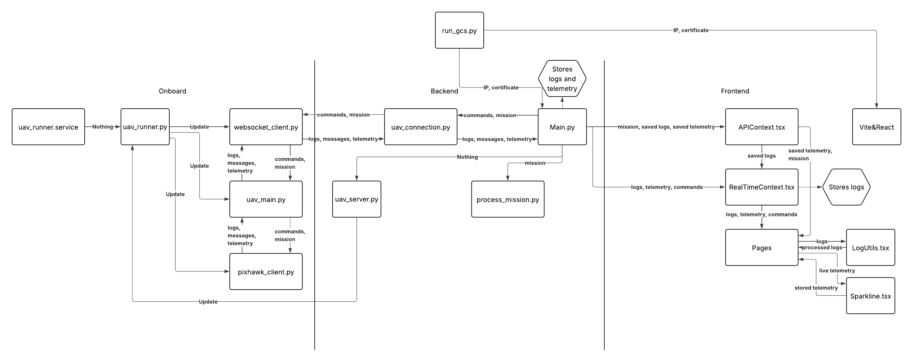
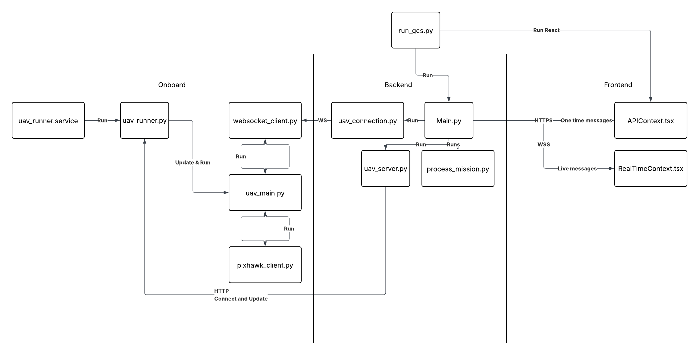

# Aetherius GCS

Aetherius GCS is a modular ground control station for fixed-wing UAVs, designed for real-time mission planning, telemetry monitoring, and system diagnostics. It features a modern React-based frontend and a Python FastAPI backend, with MAVLink integration for communication with ArduPilot-based flight controllers.

## Features

- **Mission Planning**: Waypoint editor with Dubins path support, geofence validation, and mission preview.
- **Telemetry Monitoring**: Live aircraft data via MAVLink, including GPS, battery, and attitude.
- **Driver Station**: Arm/disarm controls, flight mode switcher, and system status.
- **Log Viewer**: Stream and display real-time and historical logs with filtering and deduplication.
- **Persistent State**: Auto-caches unsaved missions and settings via `localStorage`.

## Architecture

- **Frontend** (React + TypeScript + Tailwind)
  - Cesium: 3D map visualization
  - Recharts: Graphing telemetry
  - shadcn/ui & tailwind: Interface components
  - React Context: App-wide telemetry and config state
- **Backend** (FastAPI + WebSockets + pyMAVLink)
  - Serves telemetry via WebSocket
  - REST API for logs, missions, settings
  - Websocket connection to Pi
- **Onboard (Raspberry Pi)**
  - Handles MAVLink comms to Pixhawk
  - Auto-updating over LAN via HTTP
  

## Folder Structure (WIP)

```plaintext
aetherius-uav/
├── frontend/             # React-based UI
│   ├── src/
│   │   ├── assets/
│   │   ├── components/
│   │   │   ├── pages/
│   │   │   ├── ui/
│   │   ├── lib/
├── backend/              # FastAPI + MAVLink bridge
│   ├── main.py
├── onboard/              # Raspberry Pi side program
│   ├── rpi/
├── Assets/    
```

## Page Layout
- **Dashboard**: Basic overview, Leaflet map
- **Telemetry Dashboard**: Real-time plots using rechart (battery, attitude, GPS)
- **Mission Planning**: Map, waypoint editor, geofence, path preview
- **Manual Control**: Joystick visualization, RC override, attitude indicator
  - **Mission Monitor**: Telemetry, mission control, logs, errors, full cesium map
  - **Accessory Monitor**: Lidar, camera, payload data
- **Logs**: Filtered log viewer with search and grouping
- **Settings**: Ground station config, firmware versions, preferences

## App Flowchart





## Running the Project

### Prerequisites

- Node.js (v18+)
- Python 3.11+
- MAVProxy or pyMAVLink dependencies

### Dev Setup

**Frontend:**

```bash
cd frontend
npm install
npm run dev
```

**Backend:**

```bash
cd backend
python -m venv venv
source venv/bin/activate  # or .\venv\Scripts\activate on Windows
pip install -r requirements.txt
uvicorn main:app --host 0.0.0.0 --port 55050 --reload
```

**Combined:**

```bash
python3 run_gcs.py
```

## TODO

- [x] Comms with Pi
- [x] Comms with PixHawk
- [x] Comms with backend
- [x] Send&receive message from Pixhawk
- [x] UI - Driver Station
- [ ] UI - Dashboard
- [ ] UI - Telemetry
- [x] UI - Mission planning
- [ ] UI - Manual control
- [ ] UI - Mission control
- [ ] UI - Mission monitor
- [ ] UI - Accessory monitor
- [x] UI - Logs
- [ ] UI - Settings
- [ ] Lidar
- [ ] Mission execution
- [ ] Cesium 3d map
- [ ] Live camera
- [ ] Lidar 3d map


Big problems I've encountered so far:
- Tailwind & vite not installing and working
- Page not loading
- Pi not connecting to Wi-Fi
- Pi not connecting to ssh
- Rechart not working
- Cesium not working
- Leaflet interactions not working
- Cesium doesn't stop reloading
- Pixhawk not calibrating
- Pi crashing
- Websocket not reconnecting
- Mavlink disconnecting
- Mavlink message loop freezing
- Tailwind not loading formats properly
- shadcn/ui not downloading
- https and wss not working
- Pi not booting up
- Ailerons not moving